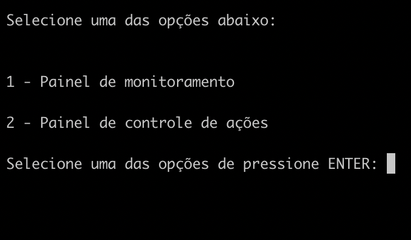
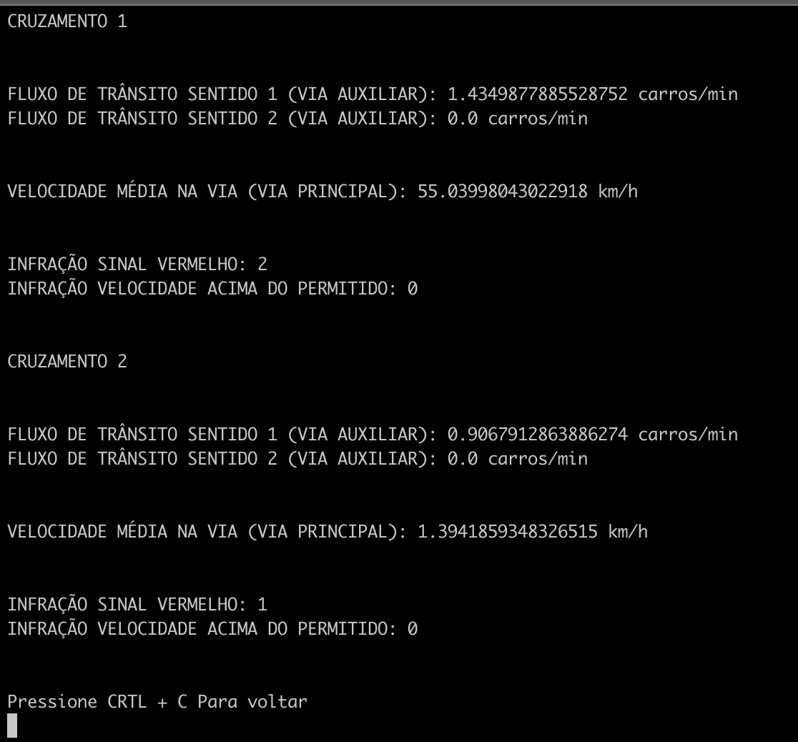
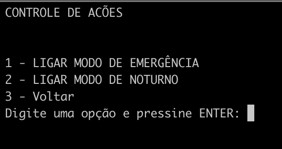
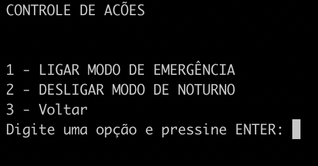

# FUNDAMENTOS DE SISTEMAS EMBARCADOS - PROJETO 1


## Configuração

### Conectando-se ao servidor central

Primeiro, deve-se configurar o servidor central. Para isso, basta executar: 

```
    ssh gabrielpereira@164.41.98.26 -p 13508
```

Senha para acesso: 170010341

Após o acesso, entre do diretório onde se encontra o código fonte do projeto para o servidor central através do comando:

```
    cd FSE-proj01/central_server
```

### Conectando-se aos servidores distribuídos

Para conectar os servidores distribuídos, é necessário a criação da instância de mais um terminal para cada servidor distribuído que irá acessar o servidor central. 
Com uma nova instância do terminal aberta (mantendo o terminal do servidor central em execução) acesse a placa que irá executar o servidor distribuído através do comando: 

```
    ssh gabrielpereira@164.41.98.17 -p 13508
```
Senha para acesso: 170010341

Após o acesso, entre do diretório onde se encontra o código fonte do projeto para o servidor distribuído através do comando:

```
    cd FSE-proj01/distribuited_server
```

OBS: As instruções acima devem ser feitas para cada instância do servidor distribuído que deseja-se conectar ao servidor central. 

## Execução

### Servidor Central

Para rodar o projeto completo, primeiro deve-se executar o servidor central. Entre na aba do terminal onde foi configurado o servidor central, e execute o comando: 

```
    python main.py 164.41.98.26 10160
```

O comando segue o seguinte formato que deve ser respeitado: 

```
    python main.py [HOST_TCP] [PORT_TCP]
```

Obs: O comando para executar servidor central, de acordo com a configuração desse manual, segue o ip 164.41.98.26 e a porta 10160, pois é onde está hospedado o servidor central. 

### Servidor Distribuído

Após executar o servidor cental, pode-se executar o servidor distribuído. Entre na aba do terminal onde foi configurado o(s) servidor distribuido(s), e execute o comando: 

- Para o servidor que irá representar o primeiro cruzamento
```
    python main.py crossing_1.json 164.41.98.26 10160
```

- Para o servidor que irá representar o segundo cruzamento
```
    python main.py crossing_2.json 164.41.98.26 10160
```

O comando segue o seguinte formato que deve ser respeitado: 

```
    python main.py [ARQUIVO_CONFIGURACAO] [HOST_TCP] [PORT_TCP]
```

Obs: O comando para executar servidor distribuido, de acordo com a configuração desse manual, segue o ip 164.41.98.26 e a porta 10160, pois é onde está hospedado o servidor central. Há também 2 arquivos que configuração para cada cruzamento que deve ser passado junto ao comando de execução. crossing_1.json e crossing_2.json, caso esteja rodando 2 cruzamentos ao mesmo tempo (Lembrar que cada cruzamento deve ser rodado em uma aba diferente do terminal). Caso somente um cruzamento for executado, basta rodar o comando uma vez na instância do terminal passando o arquivo de configuração desejado. 


## Uso

Após a execução, o seguinte menu será apresentado para monitoramento no servidor central: 



Se selecionado a opção 1, o seguinte painel será apresentado: 




 Pressionando a tecla CTRL + C, retorna-se para o menu anterior

 Se no menu inicial for selecionado a opção 2, será apresentado o menu de controle dos cruzamentos: 

 

 Se, no menu de controle for selecionado alguma opção, como 2, por exemplo, a ação deve ser executada no cruzamento e o painel de controle deverá apresentar a seguinte configuração:



OBS: Somente após desligar todos as ações é possível sair do menu de monitoramento.